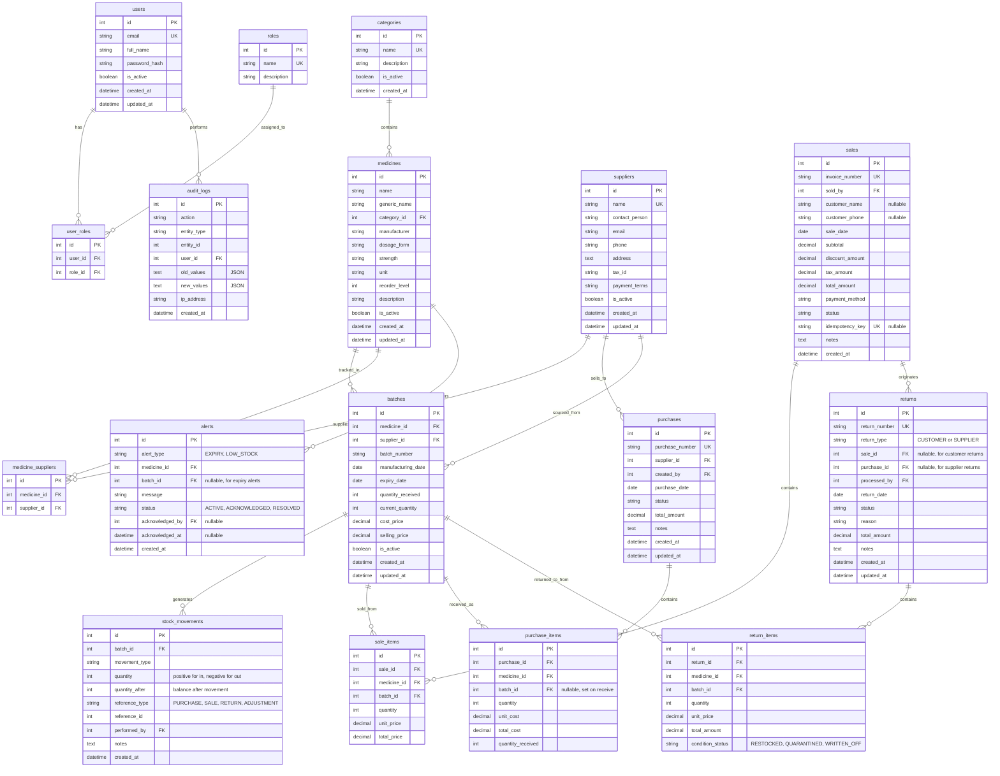

# MediStock — Database Design

## 1. Design Principles

- Normalized relational schema (3NF).
- InnoDB engine for ACID transactions and row-level locking.
- DECIMAL for all monetary fields — no floating-point currency.
- UTC DATETIME for all timestamps.
- Foreign keys with appropriate CASCADE / RESTRICT rules.
- CHECK constraints where MySQL 8.x supports them.
- Indexes based on actual query patterns.
- Soft deletes (`is_active` / `deleted_at`) for core entities.

---

## 2. Entity-Relationship Diagram



---

## 3. Table Details

### 3.1 `users`
| Column | Type | Constraints |
|--------|------|-------------|
| id | INT AUTO_INCREMENT | PRIMARY KEY |
| email | VARCHAR(255) | NOT NULL, UNIQUE |
| full_name | VARCHAR(255) | NOT NULL |
| password_hash | VARCHAR(255) | NOT NULL |
| is_active | BOOLEAN | NOT NULL, DEFAULT TRUE |
| created_at | DATETIME | NOT NULL, DEFAULT UTC_TIMESTAMP |
| updated_at | DATETIME | NOT NULL, ON UPDATE UTC_TIMESTAMP |

### 3.2 `roles`
| Column | Type | Constraints |
|--------|------|-------------|
| id | INT AUTO_INCREMENT | PRIMARY KEY |
| name | VARCHAR(50) | NOT NULL, UNIQUE |
| description | VARCHAR(255) | |

Seed values: ADMIN, PHARMACIST, INVENTORY_MANAGER, AUDITOR.

### 3.3 `user_roles`
| Column | Type | Constraints |
|--------|------|-------------|
| id | INT AUTO_INCREMENT | PRIMARY KEY |
| user_id | INT | NOT NULL, FK → users(id) |
| role_id | INT | NOT NULL, FK → roles(id) |

UNIQUE(user_id, role_id).

### 3.4 `categories`
| Column | Type | Constraints |
|--------|------|-------------|
| id | INT AUTO_INCREMENT | PRIMARY KEY |
| name | VARCHAR(100) | NOT NULL, UNIQUE |
| description | TEXT | |
| is_active | BOOLEAN | NOT NULL, DEFAULT TRUE |
| created_at | DATETIME | NOT NULL |

### 3.5 `medicines`
| Column | Type | Constraints |
|--------|------|-------------|
| id | INT AUTO_INCREMENT | PRIMARY KEY |
| name | VARCHAR(255) | NOT NULL |
| generic_name | VARCHAR(255) | |
| category_id | INT | NOT NULL, FK → categories(id) |
| manufacturer | VARCHAR(255) | |
| dosage_form | VARCHAR(50) | NOT NULL |
| strength | VARCHAR(50) | NOT NULL |
| unit | VARCHAR(50) | NOT NULL |
| reorder_level | INT | NOT NULL, DEFAULT 10 |
| description | TEXT | |
| is_active | BOOLEAN | NOT NULL, DEFAULT TRUE |
| created_at | DATETIME | NOT NULL |
| updated_at | DATETIME | NOT NULL |

UNIQUE(name, strength, dosage_form).

### 3.6 `batches`
| Column | Type | Constraints |
|--------|------|-------------|
| id | INT AUTO_INCREMENT | PRIMARY KEY |
| medicine_id | INT | NOT NULL, FK → medicines(id) |
| supplier_id | INT | FK → suppliers(id) |
| batch_number | VARCHAR(100) | NOT NULL |
| manufacturing_date | DATE | |
| expiry_date | DATE | NOT NULL |
| quantity_received | INT | NOT NULL |
| current_quantity | INT | NOT NULL, CHECK(current_quantity >= 0) |
| cost_price | DECIMAL(12,2) | NOT NULL |
| selling_price | DECIMAL(12,2) | NOT NULL |
| is_active | BOOLEAN | NOT NULL, DEFAULT TRUE |
| created_at | DATETIME | NOT NULL |
| updated_at | DATETIME | NOT NULL |

UNIQUE(medicine_id, batch_number).
INDEX(expiry_date) — for expiry alert queries.
INDEX(medicine_id, current_quantity) — for stock availability.

### 3.7 `stock_movements`
| Column | Type | Constraints |
|--------|------|-------------|
| id | INT AUTO_INCREMENT | PRIMARY KEY |
| batch_id | INT | NOT NULL, FK → batches(id) |
| movement_type | ENUM('PURCHASE_RECEIPT','SALE','CUSTOMER_RETURN','SUPPLIER_RETURN','ADJUSTMENT_IN','ADJUSTMENT_OUT','WRITE_OFF') | NOT NULL |
| quantity | INT | NOT NULL |
| quantity_after | INT | NOT NULL |
| reference_type | VARCHAR(50) | NOT NULL |
| reference_id | INT | NOT NULL |
| performed_by | INT | NOT NULL, FK → users(id) |
| notes | TEXT | |
| created_at | DATETIME | NOT NULL |

INDEX(batch_id, created_at).
INDEX(reference_type, reference_id).
INDEX(performed_by).

### 3.8 `purchases` & `purchase_items`
Standard purchase header/detail pattern. See ER diagram above.

### 3.9 `sales` & `sale_items`
Standard sale header/detail pattern with invoice number.

### 3.10 `returns` & `return_items`
Polymorphic return (customer or supplier) with item-level condition tracking.

### 3.11 `alerts`
Deduplication key: (alert_type, medicine_id, batch_id) — only one ACTIVE
alert per combination.

### 3.12 `audit_logs`
Append-only. No UPDATE or DELETE operations on this table.
INDEX(entity_type, entity_id).
INDEX(user_id, created_at).

---

## 4. Key Constraints & Invariants

1. `batches.current_quantity >= 0` — enforced by CHECK constraint.
2. `UNIQUE(medicine_id, batch_number)` — no duplicate batches.
3. `UNIQUE(invoice_number)` — unique sale invoices.
4. `UNIQUE(purchase_number)` — unique purchase orders.
5. `UNIQUE(return_number)` — unique return records.
6. All monetary fields use `DECIMAL(12,2)`.
7. Foreign keys with `RESTRICT` on delete (prevent orphaned records).
8. Stock movement ledger is reconcilable against batch balances.

---

## 5. Reconciliation Query

```sql
-- For each batch, verify:
-- quantity_received + SUM(movements.quantity) == current_quantity
SELECT
    b.id AS batch_id,
    b.batch_number,
    b.quantity_received,
    b.current_quantity,
    COALESCE(SUM(sm.quantity), 0) AS ledger_total,
    b.quantity_received + COALESCE(SUM(sm.quantity), 0) AS expected_quantity,
    CASE
        WHEN b.current_quantity = b.quantity_received + COALESCE(SUM(sm.quantity), 0)
        THEN 'OK'
        ELSE 'MISMATCH'
    END AS status
FROM batches b
LEFT JOIN stock_movements sm ON sm.batch_id = b.id
GROUP BY b.id;
```

Note: `quantity` in stock_movements is **signed** — positive for inflows
(PURCHASE_RECEIPT, CUSTOMER_RETURN, ADJUSTMENT_IN) and negative for outflows
(SALE, SUPPLIER_RETURN, ADJUSTMENT_OUT, WRITE_OFF).

Wait — actually, to make the reconciliation cleaner, let me clarify:
- `quantity_received` in batches is the **initial** stock from the purchase.
- Stock movements for the initial purchase receipt are **NOT** recorded
  (since `quantity_received` already captures it), OR they ARE recorded
  and the formula is simply `SUM(movements.quantity) == current_quantity`.

**Decision: Record ALL movements including the initial purchase receipt.**

Reconciliation becomes:
```sql
SELECT
    b.id, b.batch_number, b.current_quantity,
    COALESCE(SUM(sm.quantity), 0) AS ledger_balance,
    CASE
        WHEN b.current_quantity = COALESCE(SUM(sm.quantity), 0)
        THEN 'OK' ELSE 'MISMATCH'
    END AS status
FROM batches b
LEFT JOIN stock_movements sm ON sm.batch_id = b.id
GROUP BY b.id;
```

This is simpler and ensures every unit is accounted for in the ledger.
